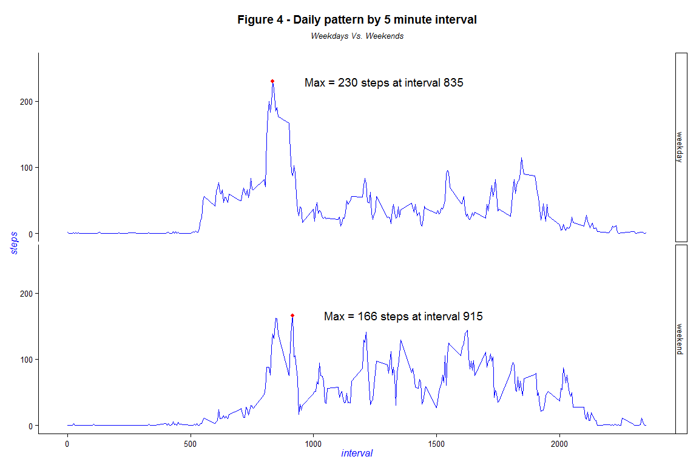

# Reproducible Research - Peer Assigment 1


### Part 1 - Loading and preprocessing the data

#### 1.1 - Load the data
The data is loaded into a data table using **read.table** and **data.table**
The following chunk shows how it's done.

```r
#___1.1___Load the data
setwd("C:/repos_github/coursera/repres/data")
dt_initial <- data.table(read.table("activity.csv", sep = ",", header = TRUE))
head(dt_initial,5)
```

```
##    steps       date interval
## 1:    NA 2012-10-01        0
## 2:    NA 2012-10-01        5
## 3:    NA 2012-10-01       10
## 4:    NA 2012-10-01       15
## 5:    NA 2012-10-01       20
```

The table above displays the first five observations from the initial dataset


#### 1.2 - Processing the data 
Aside from removing missing values, no further processing of the data seems necessary at shis point.

All further data munging and imputing is done stepwise in the assignment.

```r
#___1.2___Process/transform the data into a format suitable for the analysis
#         For this part of the assignment, only complete cases of the dataset is used
#         In other words, all missing values for all columns are removed.
#         Note, however, that the assigment requires quite a bit more data transforming, 
#         but this will be done at the appropriate parts of the assignment to 
#         show the work flow.

# Remove all observations with missing data
dt_initialNaNo <- dt_initial[complete.cases(dt_initial),]

# Rows with missing data removed
naRemoved <- nrow(dt_initial) - nrow(dt_initialNaNo)
```

Here's a table showing the first five observations from the initial dataset with all missing values removed.

```r
head(dt_initialNaNo,5)
```

```
##    steps       date interval
## 1:     0 2012-10-02        0
## 2:     0 2012-10-02        5
## 3:     0 2012-10-02       10
## 4:     0 2012-10-02       15
## 5:     0 2012-10-02       20
```


### 2 - What is the mean total number of steps taken per day?
#### 2.1 - Calculate the total number of steps taken per day 

```r
#___2.1___Calculate the total number of steps taken per day
#         For the total number of steps per day, and the corresponding histogram,
#         it is convenient to transform the data into 
#         showing unique dates in the date column.
#         This way, total steps for all time intervals are displayed for each day in
#         the datatable dt_dailysteps.
#         There are several ways you can do this. 
#         The package data.table has several methods,
#         but mostly I use an sql package for R called sqldf.

# Number of steps per day using data.table
dt_dailystepsDT <- dt_initialNaNo[,.(steps.sum = sum(steps)),by=date]

# Number of steps per day using sqldf
dt_dailysteps <- sqldf("SELECT sum(steps) as stepsum, date 
                          FROM dt_initialNaNo
                          Group by date")
dt_dailysteps <- data.table(dt_dailysteps)

rows_dt_dailysteps <- nrow(dt_dailysteps)
remove(dt_dailystepsDT)
```


Ordering the sum of steps for all intervals per day results in a table with 53 observations.
The following table displays the first 5 rows with the total number of steps per day displayed in the column named stepsum.


```r
head(dt_dailysteps, 5)
```

```
##    stepsum       date
## 1:     126 2012-10-02
## 2:   11352 2012-10-03
## 3:   12116 2012-10-04
## 4:   13294 2012-10-05
## 5:   15420 2012-10-06
```

#### 2.2 - Make a histogram of the total number of steps taken each day

```r
#___2.2___Make a histogram of number of steps taken each day
h1 <- ggplot(data=dt_dailysteps, aes(dt_dailysteps$stepsum)) 
h1 <- h1 + geom_histogram(colour = "blue", fill = "grey")
h1 <- h1 + theme_classic()
h1 <- h1 + ggtitle("Figure 1 - Daily steps for each interval") + xlab("steps")
h1 <- h1 + theme(plot.title = element_text(lineheight=.8, face="bold"))
h1 <- h1 + ylim(0, 14)
#plot(h1)
#setwd("C:/repos_github/coursera/repres")
#ggsave(filename = "Histogram Number of Steps.pdf", plot = h1)
plot(h1)
```

 

#### 2.3 - Calculate and report the mean and median of the total number of steps taken per day

```r
#___2.3___Calculate and report the mean and median 
#         of the total number of steps taken per day
nsteps <- sum(dt_dailysteps$steps)
avgsteps <- mean(dt_dailysteps$stepsum)
medsteps <- median(dt_dailysteps$stepsum)
# h1 <- h1 + geom_vline(xintercept = avgsteps, labels = "mean", show_guide = TRUE, color = "green")
# h1 <- h1 + geom_vline(xintercept = medsteps, labels = "mean", show_guide = TRUE, color = "red")
# h1

#Data table of the results
Method <- c("NA removed", "NA Imputed", "NA Zero")
Averages <- c(format(round(avgsteps, 2), nsmall = 2),"","")
Medians <-  c(format(round(medsteps, 2), nsmall = 2),"","")
#tb1 <- data.table(Method, Averages, Medians)
```

The total number of steps taken in this dataset, is **570608**. 
When accumulating all intervals per day, which is what the assignment asks for, 
the mean and median number of steps are **10766.19**  and **10765**, respectively.
These findinggs are displayed in the table below, which will be filled with more findings along the way.
So far we've calculated the mean and median after ignoring missing values. Later, we'll calculate the same values using other methods for handling missing values.


```r
tb1 <- data.table(Method, Averages, Medians)
tb1
```

```
##        Method Averages  Medians
## 1: NA removed 10766.19 10765.00
## 2: NA Imputed                  
## 3:    NA Zero
```

### 3 - What is the average daily pattern?
#### 3.1 - Make a time series plot of the 5 minute intervals averaged accross all days.

```r
#___3.1___Make a time series plot of the 5 minute intervals averaged accross all days.
#         Again, it is convenent to transform the original data.
#         Here, the data is stored as an average for each interval 
#         accross all observed days
#         in tha data table dt_dailypattern.

# Data transformation
dt_dailypattern <- (sqldf("SELECT interval, avg(steps) as steps 
                            FROM dt_initialNaNo
                            Group by interval"))
dt_dailypattern <- data.table(dt_dailypattern)

# The next step adds an index to dt_dailypattern for charting purposes.
# Using the time intervals on a continuos x-axis results in an uneven
# time series due to the jumps between, for example, 955 and 1000.

idx1 <- 1:nrow(dt_dailypattern)
dt_dailypattern <- data.table(dt_dailypattern, idx1)

# The plot, step 1
p1 <- ggplot(dt_dailypattern, aes((interval), steps))
p1 <- p1 + geom_line(colour = "blue") + theme_classic() + 
      ggtitle("Daily pattern by 5 minute interval") + xlab("interval")
p1 <- p1 + theme(plot.title = element_text(lineheight=.8, face="bold"))

# Find interval with max steps
maxsteps = max(dt_dailypattern$steps)

# Look up the corresponding interval for the max number of steps
maxint <- sqldf("SELECT interval, max(steps)
                  FROM dt_dailypattern")

dailymax <- maxint[1,2]

# The plot step 2 - Add a point in the plot indicating the interval 
#                   with max number of steps and plot it.
p1 <- p1 + geom_point(data = subset(dt_dailypattern, interval == maxint$interval[1]),
                      colour = "red")
p1 <- p1 + geom_text(data = subset(dt_dailypattern, interval == maxint$interval[1]),
                      aes(x = interval,y = steps, hjust = -0.01
                          , label = paste("max = ",dailymax, " steps for interval",
                                          maxint[1,1])))
# Plot the plot
p1 <- p1 + theme(plot.title = element_text(lineheight=.8, face="bold"))
p1 <- p1 + ggtitle("Figure 2 - Daily steps for each interval") + xlab("steps")
p1 <- p1 + ylim(0, 260)
plot(p1)
```

 

#### 3.2 Average and median steps per day

```r
#___3.2___Which 5-minute interval, on average across all the days in the dataset, 
#         contains the maximum number of steps?

# Find interval with max steps
maxsteps = max(dt_dailypattern$steps)

# Look up the corresponding interval for the max number of steps
maxint <- sqldf("SELECT interval, max(steps)
                  FROM dt_dailypattern")
```
The 5-minute interval which contains the maximum average steps per day, is **835**.
The average number of steps taken per day during this interval is **206**.

### 4 - Imputing Missing values
#### 4.1 - Calculate and report the total number of missing values

```r
# OBJECTIVE:  Replace missing step data for all intervals with
#             average number of stepds per day for those observations
#             without missing values.
#             Missing observations, if any, for date and interval are removed.

#___4.1___Calculate and report the total number of missing values in the dataset 
# A look at the data
# summary(dt_initial)

# Total number of missing values
missingTotal <- sum(sapply(dt_initial, function(x) sum(is.na(x))))
```

#### 4.2 - Devise a strategy for filling in all of the missing values in the dataset

```r
#___4.2___Devise a strategy for filling in all of the missing values in the dataset
#         There are a total of 2304 missing values in the original dataset, 
#         all of which are missing observations for steps for given dates and intervals.
#         The missing values will be replaced by the average number of steps
#         for the according interval
```

#### 4.3 - Create a new dataset that is equal to the original dataset but with the missing data filled in.

```r
#___4.3___Create a new dataset that is equal to the original dataset 
#         but with the missing data filled in.
#         There are surely many ways to do this, perhaps most efficiently in dplyr.
#         I'm going to brute force the whole process using a nested For Loop.
#         The following code loops through the table dt_imputed.
#         For each missing value, the code loops through the table dt_avgsteps, finds
#         the corresponding step count, and writes it to the table dt_imputed.

# Make a data table in which missing values will be raplaced.
dt_imputed <- dt_initial

# Make a data table that contains daily averages for all intervals
dt_avgsteps <- (sqldf("SELECT interval, avg(steps) as steps 
                        FROM dt_initialNaNo
                        Group by interval"))
dt_avgsteps <- data.table(dt_avgsteps)

# Brute Force For Loop, replacing NAs in dt_imputed with an average step count.
i <- 1
j <- 1
nmiss <- 0
fakesteps <- 0
for(i in 1:length(dt_initial$steps)) {
  #print(dt_avgsteps$steps[i])
  if (is.na(dt_initial$steps[i])) {
        #print(paste(i, "missing", sep = " - "))
        nmiss <- nmiss + 1
        for(j in 1:length(dt_avgsteps$steps)) {
          #print(paste(nmiss,j, "missing", sep = " - "))
          
          if (dt_initial$interval[i] == dt_avgsteps$interval[j]) {
              # print(paste(i,j, "missing", sep = " - "))
              dt_imputed$steps[i] <- dt_avgsteps$steps[j]
              fakesteps <- fakesteps + dt_avgsteps$steps[j]
              break
          }
        }
  }
}
#i
# nmiss
# themissing <- nrow(subset(dx1, is.na(dt_nonmissing$steps)))
# themissing
# fakesteps
# missmix <- data.table(dt_missing, dt_nonmissing$steps)

# Look at the data
# head(dt_imputed)

setwd("C:/repos_github/coursera/repres/data")
write.table(dt_imputed, "imputedData.csv", row.names = FALSE)
#remove(nonmissing)
#nonmissing <- data.table(read.table("imputedData.csv", sep = " ", header = TRUE))
```

#### 4.4 - Make a histogram of the total number of steps taken each day and Calculate and report the mean and median.

```r
#___4.4___Make a histogram of the total number of steps taken each day 
#         and Calculate and report the mean and median total number of steps taken per day

# Order sum of steps per day for all intervals
dt_dailysteps2 <- (sqldf("SELECT sum(steps) as stepsum, date 
                          FROM dt_imputed
                          Group by date"))
dt_dailysteps2 <- data.table(dt_dailysteps2)

# Look at the data
# head(dt_dailysteps)
# head(dt_dailysteps2)

# Number of steps per day, calculations
nstepsNaNo <- sum(dt_dailysteps2$steps)
avgsteNaNo <- mean(dt_dailysteps2$steps)
medstepsNaNo <- median(dt_dailysteps2$steps)

# Histogram of number of steps per day
h2 <- ggplot(data=dt_dailysteps2, aes(dt_dailysteps2$steps))
h2 <- h2 + geom_histogram(colour = "blue", fill = "grey")
h2 <- h2 + theme_classic()
h2 <- h2 + ggtitle("Total number of steps per day") + xlab("steps")
h2 <- h2 + ylim(0, 14)
#plot(h2)
setwd("C:/repos_github/coursera/repres")
ggsave(filename = "Histogram Number of Steps no missing values.pdf", plot = h1)
```

There are a total of 2304 missing values in the original dataset, 
all of which are missing observations for steps for given dates and intervals.

The sum of steps added to the original dataset is 85128.
Below is a histogram showing the distribution of steps after missing values have been imputed.

```r
plot(h2)
```

 

Comparing the histogram in figure 3 with the histogram in figure 1 shows that the imputed dataset leads to an increased number of observations at the center of the distribution. Let us take a quick look at why this happens by taking the difference between each observation in the imputed dataset and another table where all missing values are replacd by zero.

#### 4.4.2 - Imputing Missing values, a closer look at the implications.

```r
# Make a table of the origninal dataset where all missing values for steps are replaced by 0.
    dt_initialNa0 <- dt_initial
    dt_initialNa0[is.na(dt_initialNa0)] <- 0
  
dt_diff <- (dt_imputed - dt_initialNa0)
    dt_diff$date <- dt_initial$date
    dt_diff$interval <- dt_initial$interval
    sum(dt_diff$steps)
```

```
## [1] 85128
```

```r
dt_diffdays <- data.table(sqldf("SELECT sum(steps) as stepsum, date 
                                  FROM dt_diff
                                  Group by date"))
sum(dt_diffdays$stepsum)
```

```
## [1] 85128
```

```r
dt_diffdays <- (sqldf("SELECT sum(steps) as stepsum, date 
                        FROM dt_diff
                        Group by date"))
dt_diffdays <- data.table(dt_diffdays)
sum(dt_diffdays$stepsum)
```

```
## [1] 85128
```

```r
# Make datatable of dt_diffdays with all zeros removed
# In other words, alld days with no effects from the imputing process are disregarded.
dt_diffdaysNo0 <- sqldf("SELECT stepsum, date 
                      FROM dt_diffdays
                      Where stepsum <> 0
                      Group by date")
dt_diffdaysNo0
```

```
##   stepsum       date
## 1   10641 2012-10-01
## 2   10641 2012-10-08
## 3   10641 2012-11-01
## 4   10641 2012-11-04
## 5   10641 2012-11-09
## 6   10641 2012-11-10
## 7   10641 2012-11-14
## 8   10641 2012-11-30
```

```r
nrow(dt_diffdaysNo0)
```

```
## [1] 8
```

The previous table shows the sum of the steps that have been added to the dataset due to missing values.
The fact that the sum of 10641 is equal for all days reveals an interesting detail. 
It turns out that all dates with missing values, have missing values for all intervals, 
and that there is no missing interval for all dates contained in the dataset.
This means that it would not matter much if the imputing process replaced missing values for each and every interval, or for each date only.
  
### 5 - Are there differences in activity patterns between weekdays and weekends?
#### 5.1 - Create a new factor variable in the dataset with two levels

```r
#___5.1___Create a new factor variable in the dataset with two levels - 
#         "weekday" and "weekend" indicating whether a given date 
#         is a weekday or weekend day.

# Make variables for factor categories
dayofweek <- 1:nrow(dt_imputed)

# Factor categories
wday <- c("Monday", "Tuesday", "Wednesday", "Thursday", "Friday")

# Change regional settings to match the English language.
Sys.setlocale("LC_TIME", "English")
```

```
## [1] "English_United States.1252"
```

```r
# Distribute factor categories
for(i in 1:length(dt_imputed$date)) {
    cday <- weekdays(as.Date(dt_imputed$date[i]))
    if (cday %in% wday) {
        dayofweek[i] <- "weekday"
    }else{
        dayofweek[i] <- "weekend"
    }
}

# Add the factor variables to dt_avgsteps in a new table
dt_imputed2 <- data.table(dt_imputed, dayofweek)

# Take a look at the nwe data
head(dt_imputed2, 5)
```

```
##    steps       date interval dayofweek
## 1:     1 2012-10-01        0   weekday
## 2:     0 2012-10-01        5   weekday
## 3:     0 2012-10-01       10   weekday
## 4:     0 2012-10-01       15   weekday
## 5:     0 2012-10-01       20   weekday
```

#### 5.2 - Make a panel plot

```r
# Reset regional settings
# Sys.setlocale("LC_TIME", "Norwegian")

#_________Calculations on weekdays
# Average steps per interval for each weekday
dt_weekdaypattern <- data.table(sqldf("SELECT interval, avg(steps) as steps, dayofweek 
                            FROM dt_imputed2
                            WHERE dayofweek = 'weekday'
                            Group by interval"))

# Find max interval with corresponding value for weekdays
maxsteps_wday = max(dt_weekdaypattern$steps)

# Look up the corresponding interval for the max number of steps for weekdays
maxint_wday <- sqldf("SELECT interval, max(steps)
        FROM dt_weekdaypattern")

# Make new variables for dt_weekdaypattern in dt_weekdaypattern, indicating interval with max value
remove(intvmax)
stepmax <- 1:nrow(dt_weekdaypattern)
intvmax <- 1:(length(stepmax))
maxintv <- maxint_wday$interval[1]

for(i in 1:nrow(dt_weekdaypattern)) {
    if (dt_weekdaypattern$steps[i] == maxsteps_wday) {
        stepmax[i] <- paste("Maxi = ", maxsteps_wday, " steps at interval ", maxintv, sep = "")
        intvmax[i] <- maxintv
    }else{
        stepmax[i] <- NA
        intvmax[i] <- NA
    }
}

dt_weekdaypattern <- data.table(dt_weekdaypattern, intvmax, stepmax)


#_________Calculations on weekends
# Average steps per interval for each weekend
dt_weekendpattern <- (sqldf("SELECT interval, avg(steps) as steps, dayofweek 
                              FROM dt_imputed2
                              WHERE dayofweek = 'weekend'
                              Group by interval"))
dt_weekendpattern <- data.table(dt_weekendpattern)

# Find max interval with corresponding value for weekends
maxsteps_wend = max(dt_weekendpattern$steps)

# Look up the corresponding interval for the max number of steps for weekends
maxint_wend <- sqldf("SELECT interval, max(steps)
        FROM dt_weekendpattern")

# Make new variables for dt_weekendpattern in dt_weekendpattern, indicating interval with max value
remove(intvmax)
stepmax <- 1:nrow(dt_weekendpattern)
intvmax <- 1:(length(stepmax))
maxintv <- maxint_wend$interval[1]

for(i in 1:nrow(dt_weekendpattern)) {
    if (dt_weekendpattern$steps[i] == maxsteps_wend) {
        stepmax[i] <- paste("Maxi = ", maxsteps_wend, " steps at interval ", maxintv, sep = "")
        intvmax[i] <- maxintv
    }else{
        stepmax[i] <- NA
        intvmax[i] <- NA
    }
}

dt_weekendpattern <- data.table(dt_weekendpattern, intvmax, stepmax)

# Union dt_weekdaypattern and dt_weekendpattern into dt_weekpatterns
# dt_weekendpattern <- data.table(dt_weekendpattern, stepmax)

dt_weekpatterns <- (sqldf("SELECT * from dt_weekdaypattern 
                            UNION ALL
                              SELECT * from dt_weekendpattern
                            ORDER BY interval"))
dt_weekpatterns <- data.table(dt_weekpatterns)

# Panel plot for average steps per interval, distiingueshed by weekday or weekend
p3 <- ggplot(dt_weekpatterns, aes(interval, steps)) + geom_line(colour = "blue")
p3 <- p3 + theme_classic()
p3 <- p3 + facet_grid(dayofweek ~ .)

p3 <- p3 + geom_text(aes(x = interval, y = steps, label = stepmax, group=NULL),data=dt_weekpatterns, hjust = -0.2)
p3 <- p3 + geom_point(data=subset(dt_weekpatterns, !is.na(stepmax)), colour = "red")

p3 <- p3 + ggtitle("Daily pattern by 5 minute interval - Weekdays vs Weekend") 
p3 <- p3 + theme(plot.title = element_text(lineheight=.8, face="bold"))

p3 <- p3 + ylim(0, 260)
plot(p3)
```

 

Comparing the pattern for average number of steps for each interval for weekdays versus weekends shows that the maximum number of steps is quite a bit lower and appears later in the day on weekends. In other words, you tend to get up later in the weekends and run around less. Sounds sweet.


```r
#___1.0___  Make md file
#setwd("C:/repos_github/coursera/RepData_PeerAssessment1")
#getwd()
#library(knitr)
#knit('PA1_template.Rmd')
```


